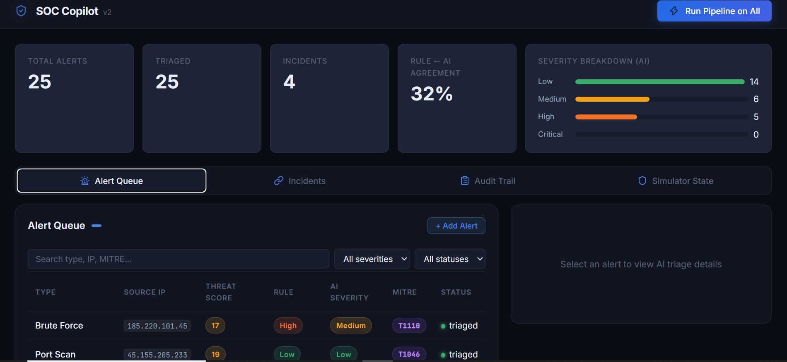
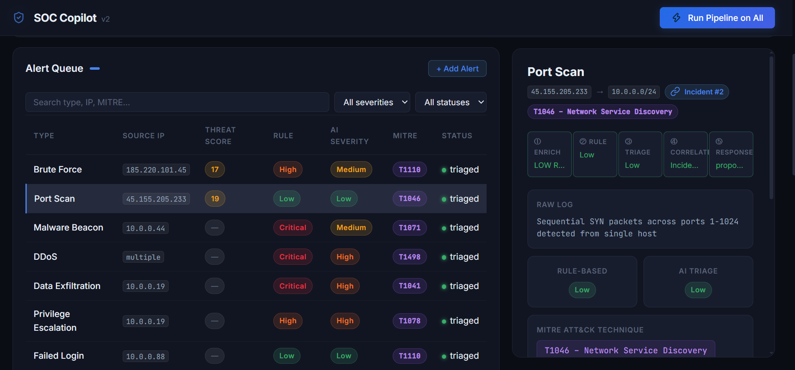
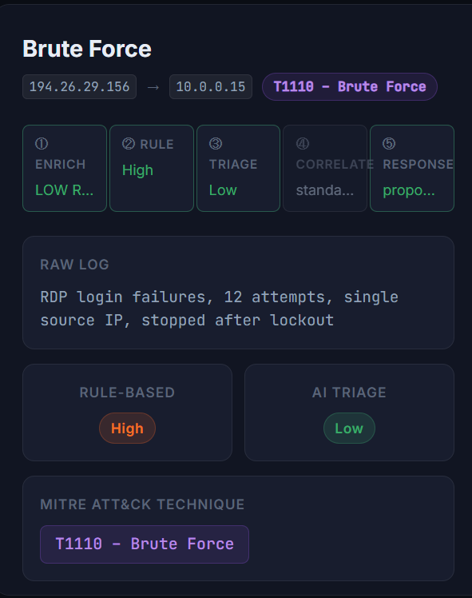
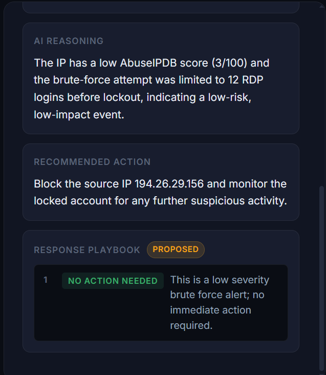
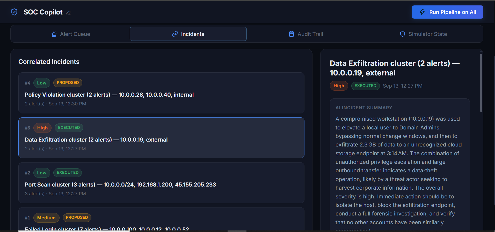
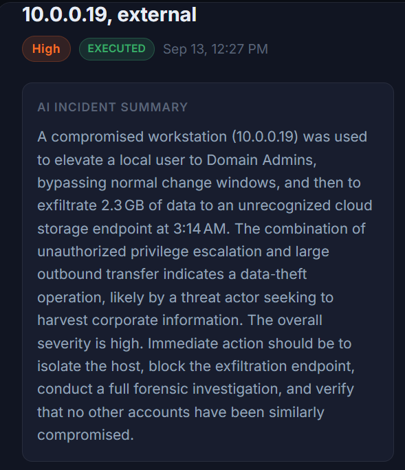
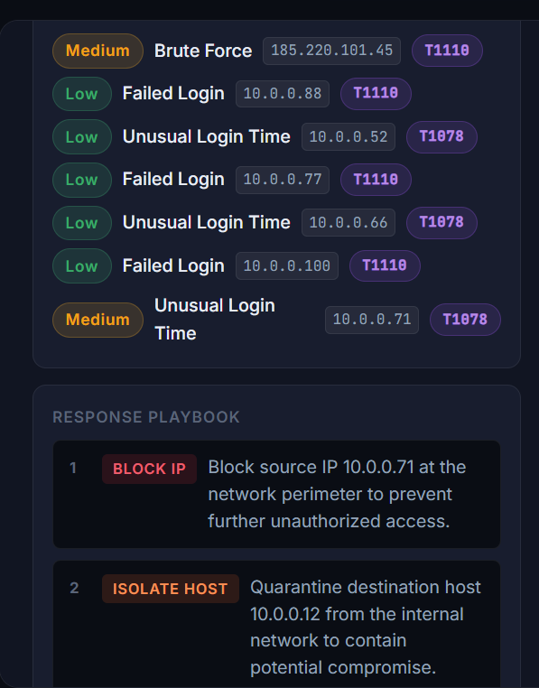
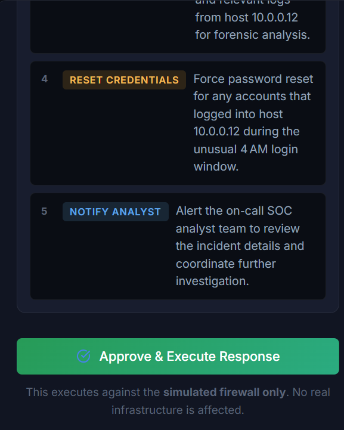
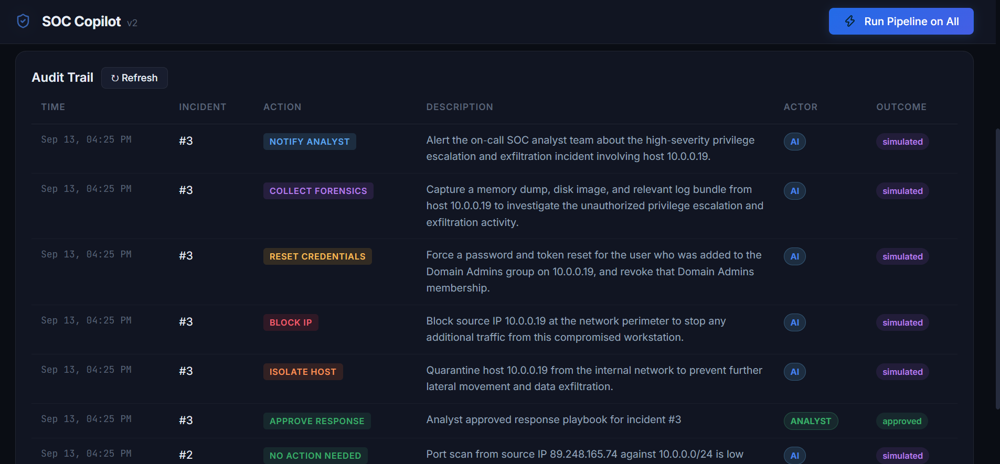

# 🛡️ SOC Copilot

An AI-assisted Security Operations Center triage platform. Every incoming alert is run through a **4-agent AI pipeline** — enrichment, triage, correlation, and response — and compared side-by-side against a deterministic rule-based baseline, so the value the AI adds is measurable, not just assumed.

Built as an independent portfolio project — a blue-team/DFIR companion to the offensive-security work in [ReconBoard](https://github.com/aleenaamjad-21/reconboard).

---

## 📸 Screenshots

> Dashboard · Alert Queue · Alert Detail (pipeline trace + reasoning + playbook) · Incidents · Incident Detail (summary + playbook + approval) · Audit Trail · Simulator State

|  |  |
|---|---|
|  |  |
| Dashboard Overview | Alert Queue |
|  |  |
| Alert Detail (pipeline trace) | Alert Detail (reasoning & playbook) |
|  |  |
| Correlated Incidents | Incident Detail (AI summary) |
|  |  |
| Incident Detail (playbook steps) | Incident Detail (approve & execute) |
|  | .png) |
| Audit Trail | Simulator State (top) |
| .png) | |
| Simulator State (action log) | |

---

## ✨ Features

- **Multi-agent triage pipeline** — Enrichment → Rule Baseline → AI Triage → Correlation → Response, each step auditable independently
- **Rule-based vs AI comparison** — every alert triaged by both a keyword baseline and an LLM, so the dashboard shows exactly where and how much the AI adds value
- **Threat intelligence enrichment** — live IP reputation lookups via VirusTotal, converted into a 0–100 threat score
- **MITRE ATT&CK tagging** — each alert classified against real ATT&CK techniques by the triage agent
- **Incident correlation** — related alerts (same source/destination IP within a time window) auto-grouped into incidents with an AI-generated summary
- **SOAR-style simulated response** — AI proposes a containment playbook (block IP, isolate host, notify analyst, etc.); nothing executes without analyst approval, and even then only against an in-memory simulated firewall — **no real infrastructure is ever touched**
- **Full audit trail** — every simulated action logged with actor, outcome, and timestamp
- **Search & filter** — filter the alert queue by type, IP, MITRE technique, severity, or status
- **Dashboard** — live stats, severity breakdown, rule↔AI agreement rate

---

## 🛠️ Tech Stack

| Layer            | Technology                                  |
| ----------------- | -------------------------------------------- |
| Backend            | Python, FastAPI                              |
| Database           | SQLite via SQLAlchemy                        |
| AI Triage          | Groq (`openai/gpt-oss-20b`)                  |
| Threat Intel       | VirusTotal API                               |
| Background Jobs    | FastAPI `BackgroundTasks`                    |
| Frontend           | Vanilla HTML / CSS / JavaScript (no framework) |
| Icons              | Lucide                                       |

---

## 🧠 How the Pipeline Works

```
Alert ingested
     │
     ▼
① Enrichment Agent  ──  VirusTotal IP reputation lookup (skipped for internal/private IPs)
     │
     ▼
② Rule Baseline     ──  deterministic keyword-based severity (instant, no API call)
     │
     ▼
③ Triage Agent       ──  Groq LLM: severity, false-positive flag, MITRE technique, reasoning
     │
     ▼
④ Correlation Agent  ──  groups related alerts into an Incident, AI-generated summary
     │
     ▼
⑤ Response Agent     ──  proposes a containment playbook (JSON, structured steps)
     │
     ▼
Analyst reviews → Approve & Execute → Simulated firewall only, full audit log
```

Every step's output is stored independently in the database — nothing is a black box. The dashboard shows the rule-based result and the AI result side by side for every alert.

---

## 🏗️ Architecture

```
backend/
  agents/
    enrichment_agent.py     ← VirusTotal threat-intel lookup
    triage_agent.py         ← LLM severity + MITRE classification
    correlation_agent.py    ← Groups alerts into incidents
    response_agent.py       ← Generates containment playbooks
  pipeline.py                ← Orchestrates all 4 agents in sequence
  response_simulator.py      ← In-memory simulated firewall, executes approved playbooks
  rule_engine.py              ← Keyword-based severity baseline
  llm_client.py                ← Shared Groq API client
  models.py / schemas.py       ← Alert, Incident, AuditLog
  main.py                      ← FastAPI routes
frontend/
  index.html / app.js / style.css   ← Dashboard (Alert Queue, Incidents, Audit Trail, Simulator State)
```

---

## 🚀 Getting Started

### Prerequisites

- Python 3.11+
- A free [Groq API key](https://console.groq.com/keys)
- A free [VirusTotal API key](https://www.virustotal.com/)

### Setup

```bash
git clone https://github.com/aleenaamjad-21/soc-copilot.git
cd soc-copilot/backend

pip install fastapi uvicorn sqlalchemy pydantic requests python-dotenv
```

Create a `.env` file in `backend/`:

```
GROQ_API_KEY=your-groq-key-here
VIRUSTOTAL_API_KEY=your-virustotal-key-here
```

Seed the database and start the backend:

```bash
python seed_data.py
python -m uvicorn main:app --reload --port 8001
```

In a second terminal, serve the frontend:

```bash
cd frontend
python -m http.server 5500
```

Open `http://localhost:5500` in your browser.

---

## 🔐 Safety Design

- The Response Agent only ever *proposes* actions — nothing executes without explicit analyst approval
- Approved actions run against an **in-memory simulated firewall**, never real infrastructure
- Simulator state resets on server restart by design
- Every action, approved or simulated, is written to a full audit log

---

## 🔮 Future Enhancements

- Real dataset ingestion (CICIDS2017 / live honeypot feed) in place of synthetic seed alerts
- PDF incident report export
- Deployment to a public URL (Render/Railway + Vercel)

---

## 👩‍💻 Author

**Aleena Amjad**
CS Student — Cybersecurity Track (Ethical Hacking & Penetration Testing)
COMSATS University Islamabad, Sahiwal Campus

[](https://linkedin.com/in/aleena-amjad) [](https://github.com/aleenaamjad-21)

---

*Built with FastAPI, Groq, and VirusTotal · Independent portfolio project*